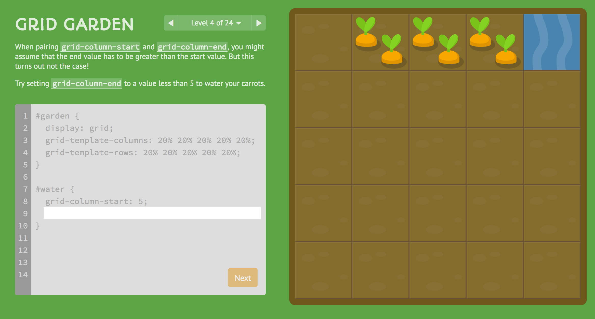

Grid Garden
=======

Grid Garden is a game for learning CSS grid layout. Check it out at [cssgridgarden.com](https://cssgridgarden.com).

## Author

Thomas Park

* [Twitter](https://twitter.com/thomashpark)
* [Homepage](https://thomaspark.co)
* [GitHub](https://github.com/thomaspark)

## Translators

My gratitude to these contributors for their translations.

* Albanian by [Enea Muskaj](https://github.com/eneamuskaj)
* Arabic by [Basel Akasha](https://github.com/baselakasha)
* Bulgarian by [radoAngelov](https://github.com/radoAngelov)
* Catalan by [Xavier Gaya](https://github.com/xavigaya)
* Chinese Simplified by [Jin](https://github.com/winar-jin)
* Chinese Traditional by [Joy Shan-Chun Kuo](https://github.com/joykuotw)
* Dutch by [Wietse Neven](https://github.com/wietseneven)
* Estonian by [Sten Leinasaar](https://github.com/StenLeinasaar)
* Farsi by [leonine90](https://github.com/leonine90)
* French by [Forresst](https://github.com/forresst)
* Finnish by [Minna N.](https://github.com/minna-xD)
* German by [Rafael Schwemmer](https://github.com/schwemmer)
* Greek by [lmintmate](https://github.com/lmintmate)
* Hungarian by [Krisztian Papp](https://github.com/pehsa)
* Indonesia by [I Putu Cahya Adi Ganesha](https://github.com/Ipcagr1d)
* Italian by [sirLisko](https://github.com/sirLisko)
* Japanese by [shuuji3](https://github.com/shuuji3)
* Korean by [YunHak Kwon](https://github.com/tienne)
* Latvian by [Arturs Kirtovskis](https://github.com/Akirtovskis)
* Norwegian by [Victoria Bergquist](https://github.com/vicbergquist)
* Polish by [Jawa the Cat](https://github.com/jaworek)
* Portuguese (Brazil) by [Gabriel](https://github.com/gcacars)
* Portuguese (Portugal) by [João Bagio](https://github.com/jbagio)
* Romanian by [Vlad](https://github.com/pckltr)
* Russian by [Zaurbek Zhakupov](https://github.com/zzhakupov)
* Spanish by [Ezequiel Pequeño Calvar](https://github.com/Remohir)
* Swedish by [Johannes Holmberg](https://github.com/johannesholmberg)
* Tagalog by [goriio](https://github.com/goriio)
* Thai by [Anurat Chapanond](https://github.com/anurat)
* Turkish by [serdar](https://github.com/yigitserdar)
* Ukrainian by [Igor Klimchuk](mailto:igor.klimchuk@tstechpro.com)
* Vietnamese by [Duy Phan](https://github.com/duyphanz)

Don't see your language on the list? Add it!

Text to be translated is found in `docs.js`, `levels.js`, and `messages.js`.

Fork the [repo](https://github.com/thomaspark/gridgarden/), add your translations, and submit a pull request.

## Copyright and License

Copyright 2017 Thomas Park. Code released under [the MIT License](https://github.com/thomaspark/gridgarden/blob/gh-pages/LICENSE). Images released under [Creative Commons](https://creativecommons.org/licenses/by/3.0/legalcode.txt).
